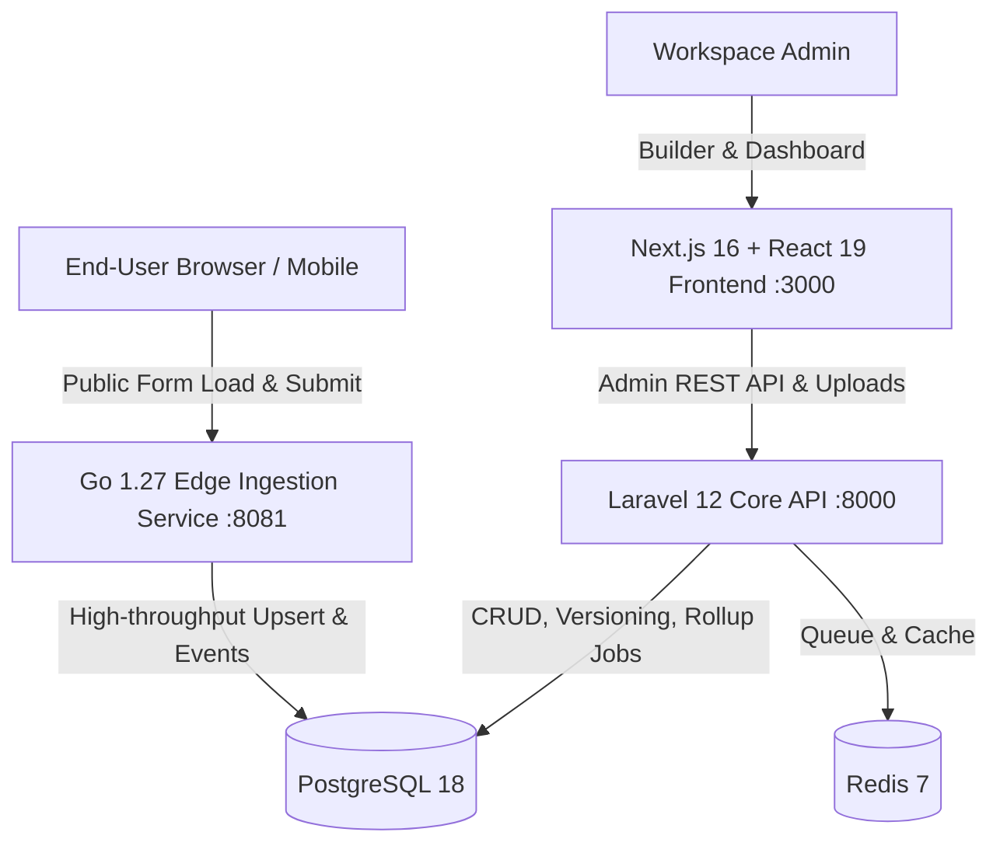

# FormForge

> **High-throughput headless form infrastructure & drag-and-drop builder with deep field-level drop-off analytics.**


<p align="center">
  
</p>

FormForge is a modern three-tier form system designed for developers who need robust, high-volume form ingestion without sacrificing rich visual builder interfaces or deep behavioral analytics.

---

## 🎯 Positioning & Honest Comparison

FormForge does not try to be an all-in-one marketing suite or a direct clone of Typeform / Formbricks.

| Feature | Typeform / Formbricks | FormForge |
|---|---|---|
| **Form Ingestion Architecture** | Monolithic PHP / Node app | **Dedicated Go Edge Service** (<15MB RAM, 10k+ req/s) |
| **Field Drop-off Analytics** | Basic summary / paid tiers | **Built-in telemetry & per-field drop-off funnel** |
| **Conditional Logic** | Arbitrary visual graphs | **Backward-only strict JSON schema** (prevents cycles) |
| **Partial Response Autosave** | Often requires paid plan | **Native 3s debounced upsert** via session storage |
| **Honeypot & Rate Limiting** | Cloudflare / external WAF | **Native sliding-window limiter & silent honeypot** |
| **Billing & Stripe Integration** | Yes | **No (Deliberate Out-of-Scope)** |
| **Multi-Step Survey Templates** | Hundreds of presets | **Developer-first raw schema & custom palette** |

---

## 🏗 Architecture & Service Split

FormForge uses a three-tier architecture sharing a single PostgreSQL 18 and Redis 7 cluster:



### 1. Backend Core (`backend/` — Laravel 12 + PHP 8.3+)
- Workspace management and multi-user authentication (Sanctum tokens).
- Canonical schema validation, form versioning, and draft publishing.
- File upload handling with MIME and size verification (`POST /api/uploads`).
- Paginated response viewer and streaming CSV export.
- Asynchronous analytics aggregation (`RollupFormAnalyticsJob`).

### 2. Edge Ingestion Service (`edge/` — Go 1.27)
- Ultra-low latency public form serving (`GET /f/:slug`).
- Atomic submission upsert with idempotency key `(form_id, session_id)`.
- Sliding-window IP rate limiter & invisible `_ff_hp` bot honeypot.
- High-throughput telemetry event ingestion (`view`, `start`, `field_focus`, `field_blur`, `complete`).

### 3. Builder & Renderer Frontend (`frontend/` — Next.js 16 + Tailwind CSS v4)
- Interactive drag-and-drop Form Builder (`@dnd-kit/sortable`).
- 9 core field types: `text`, `email`, `number`, `textarea`, `choice`, `multi_choice`, `rating`, `date`, `file_upload`.
- Client-side dynamic `FormRenderer` with backward conditional logic evaluation.
- Debounced (3s) partial response autosave engine with visual status indicator (`Menyimpan draf...` / `Tersimpan otomatis`).
- Analytics dashboard featuring KPI cards, funnel visualizer, and drop-off drop rates.

---

## ⚡ Quickstart & Local Setup

### 1. Prerequisites
- Docker & Docker Compose
- Node.js 20+ & npm
- PHP 8.3+ & Composer
- Go 1.22+

### 2. Boot Infrastructure
```bash
# Clone and enter directory
cd /mnt/data/01_Projects/Porto/formforge

# Start PostgreSQL (5433) and Redis (6380)
docker compose up -d

# Verify database readiness
bash scripts/wait-for-db.sh
```

### 3. Setup Backend (Laravel)
```bash
cd backend
cp .env.example .env
composer install
php artisan key:generate
php artisan migrate --seed
php artisan serve --port=8000
```

### 4. Setup Edge Service (Go)
```bash
cd edge
go run cmd/server/main.go --port=8081
```

### 5. Setup Frontend (Next.js)
```bash
cd frontend
npm install
npm run dev
```
Open `http://localhost:3000` in your browser.

---

## 🧪 Test Suite & Quality Gates

FormForge enforces strict test coverage and local CI verification:

- **Laravel Backend:** 94 feature & unit tests (`php artisan test`) — 100% pass.
- **Frontend Vitest:** 145 unit & component tests across 14 suites (`npm test`) — 100% pass.
- **Go Edge Service:** Unit tests for schema validation, honeypot, rate limiting, and event handling (`go test ./...`) — 100% pass.
- **Playwright E2E:** 6 end-to-end browser scenarios testing the complete workflow (Builder, Logic, Responses, Analytics, Partial Autosave, File Upload) — 100% pass.
- **Local CI:** 11 automated gates (`scripts/local-ci.sh --tier t0`) verifying secrets, lint, typecheck, tests, audit, and build.

```bash
# Run complete verification
bash scripts/local-ci.sh --tier t0
```

---

## 📜 Architecture Decision Records (ADRs)

Key architectural choices are recorded in `docs/adr/`:
- [ADR 0001: Split Three-Tier Services](docs/adr/0001-split-three-tier-services.md)
- [ADR 0002: Canonical JSON Schema Contract](docs/adr/0002-canonical-json-schema-contract.md)
- [ADR 0003: Event Telemetry & Daily Rollup](docs/adr/0003-event-telemetry-and-daily-rollup.md)
- [ADR 0004: Partial Submission Idempotency](docs/adr/0004-partial-submission-idempotency.md)

---

## 📄 License
MIT License. Built by Samid.