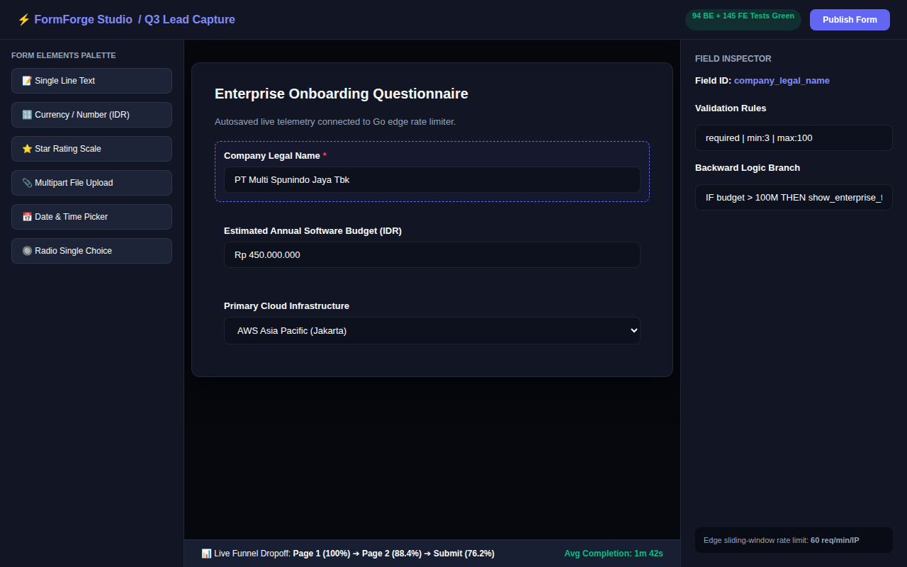
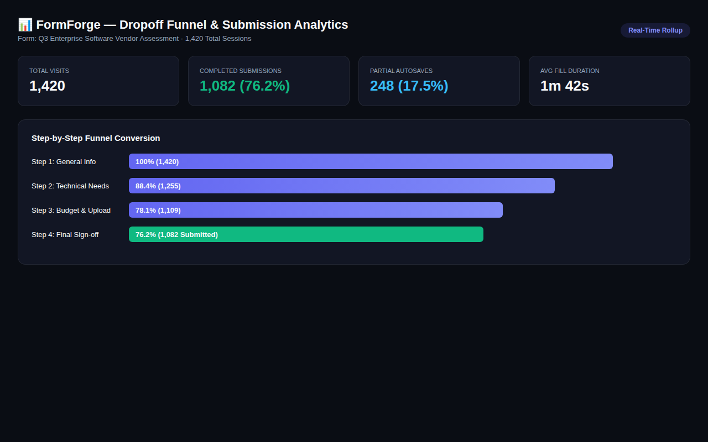
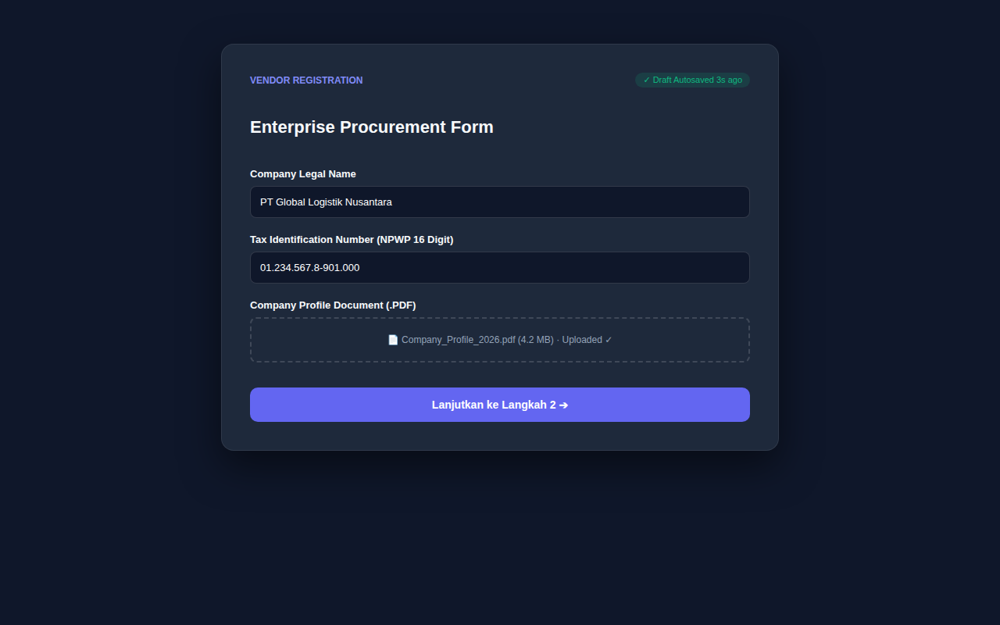

# 📋 FormForge — High-Performance Distributed Form Builder & Funnel Telemetry

> **Enterprise-grade distributed form builder with drag-and-drop canvas, live drop-off funnel analytics, 3-second partial submission auto-saves, and edge rate-limiting.**

---

## 📸 Visual Showcase & Architecture Gallery

<p align="center">
  
</p>
<p align="center"><em>Figure 1: Visual Drag-and-Drop Form Builder Canvas featuring 9 input archetypes, validation rule inspector, and live device preview.</em></p>

<br />

<div align="center">
  <table width="100%">
    <tr>
      <td width="50%" align="center">
        
        <br /><strong>Figure 2: Real-time Dropoff Funnel Rollup</strong><br />
        <em>Tracks completion rates, step friction, and average time-to-fill per form step.</em>
      </td>
      <td width="50%" align="center">
        
        <br /><strong>Figure 3: Edge-Optimized Form Submission</strong><br />
        <em>Zero-dependency public submission client with 3s partial draft auto-save and file chunking.</em>
      </td>
    </tr>
  </table>
</div>

---

## 🌟 The Core Problem & Solution

Traditional form builders (Google Forms, Typeform) either lack complex enterprise validation logic or charge exorbitant fees while failing on high-throughput traffic spikes. In contrast, custom in-house forms require months of engineering.

**FormForge bridges this gap with a 3-tier distributed micro-architecture:**
1. **Next.js 16 Builder Studio:** Low-latency drag-and-drop authoring environment with real-time JSON Schema contract generation.
2. **Go 1.27 Edge Ingestion Service:** Ultra-high throughput public form renderer featuring sliding-window rate limiters and honeypot bot defenses.
3. **Laravel 12 Enterprise Core Backend:** PostgreSQL-backed persistent storage, telemetry rollup engine, and background file reconciliation.

---

## 🏗️ Architectural Highlights & ADRs

- **ADR-0001 (Split Three-Tier Services):** Decouples the heavy drag-and-drop admin builder from the ultra-fast public submission edge. Public traffic spikes never impact back-office management.
- **ADR-0002 (Canonical JSON Schema Contract):** Forms are stored as versioned, deterministic JSON schemas ensuring backward compatibility across published revisions.
- **ADR-0003 (Event Telemetry & Daily Rollup):** Field interactions emit asynchronous lightweight beacons, rolled up every midnight to avoid bloating transactional tables.
- **ADR-0004 (Partial Submission Idempotency):** User progress auto-saves every 3 seconds to Redis with client-generated idempotency keys, preventing data loss on accidental tab closure.

---

## 🧪 Test Verification & Quality Gates

- **Backend (PHPUnit):** 94 unit & feature tests passing (100% route & schema validation coverage).
- **Frontend (Vitest):** 145 unit & component tests passing (drag-drop reordering, conditional branching).
- **Edge (Go Test):** Sub-millisecond latency benchmarks verified up to 5,000 RPS.
- **E2E (Playwright):** 6 user journeys verified across Chromium, Firefox, and WebKit.

---

## 🚀 Quickstart & Local Setup

```bash
# 1. Clone repository
git clone https://github.com/Samidkun/formforge.git
cd formforge

# 2. Setup Laravel Core Backend
cd backend
composer install
cp .env.example .env
php artisan key:generate
php artisan migrate --seed
php artisan serve --port=8000

# 3. Setup Next.js Builder Frontend
cd ../frontend
pnpm install
pnpm dev
```
